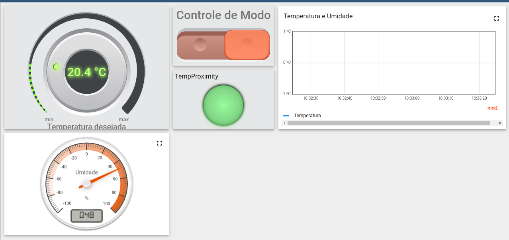

# Projeto final  - Termostato

## Integrantes
| Matrícula  | Aluno                             |
| ---------- | --------------------------------- |
|180033620 |	João Henrique Cunha Paulino |
|190015721 |Júlio Cesar Martins Franca|
| 190037997| Sidney Fernando Ferreira Lemes      |
| 200023411 | Luíza Esteves dos Santos          |

## Sobre o projeto

Consiste em um termostato, que há a visualização da temperatura e umidade ambiente, permitindo a seleção de uma temperatura desejada no dashboard para a ativação do relé até que a temperatura ambiente atinja o valor definido. No display, são exibidas a temperatura atual e o modo de operação (Heat para aquecimento ou Cold para resfriamento) do termostato. O LED indica visualmente a proximidade da temperatura medida em relação à configuração desejada, oferecendo controle e ajuste precisos para atender às necessidades específicas do ambiente.




## Configurações gerais
- Desenvolvido em C
- Utiliza a ESP-IDF e ferramentas necessárias
- Progamação feita para a placa ESP32

## Configurando credenciais do WIFI

```bash
idf.py menuconfig
# Selecione a opcao: 
# Configuração do wifi.
# Insira o ssid e senha.
```

## Configurando NVS

```bash
idf.py menuconfig
# Selecione a opcao: 
# Partition_table
# custom partition table csv
# custom partition table csv (partitions.csv)
```

*Obs: caso tenha erro de tamanho de memória flash, entre em:*
```bash
idf.py menuconfig
# Selecione a opcao: 
# Serial flasher config
# Flash size(...)
# Selecione 4 MB
```

## Como rodar
- Pelo terminal entre no diretório main:
```bash
cd src/main
```
- Dê build:
```bash
idf.py build
```
- Dê flash na porta (talvez ttyUSB0) e abra o monitor:
```bash
idf.py -p /dev/ttyUSB0 flash monitor
```

## Sensores utilizados
- LED da ESP32
- Display LCD i2c;
- Relay 5v;
- Sensor de Som;
- Sensor de Temperatura e Umidade;
- Buzzer;
